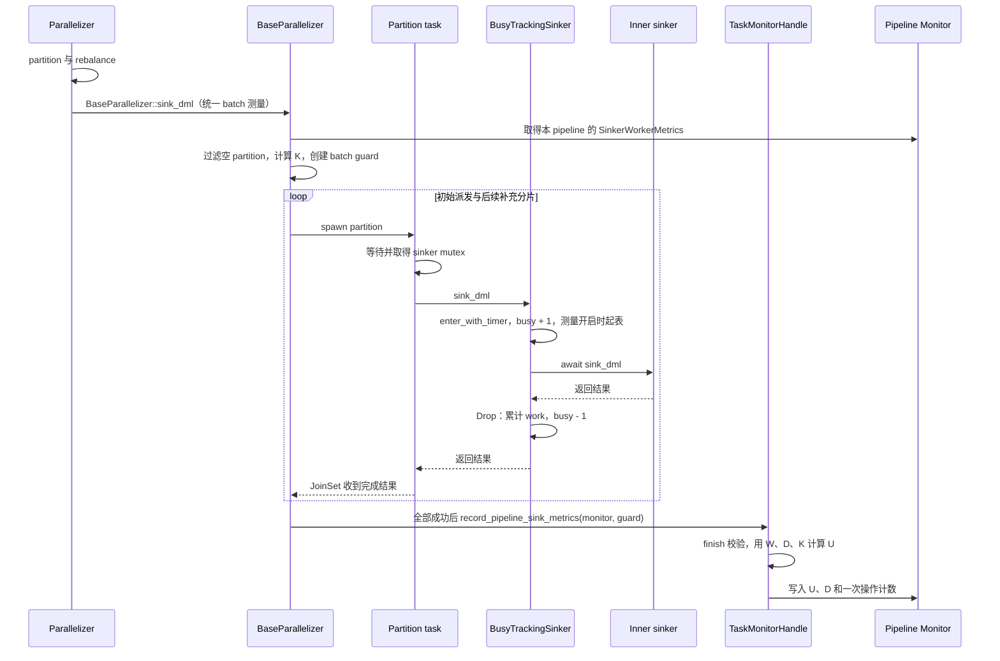

# Sinker 并行利用率与 global metrics 设计

关联 issue：[apecloud/ape-dts#591](https://github.com/apecloud/ape-dts/issues/591)。

状态：已实现并通过本地验证。本分支实现 batch 利用率、墙钟耗时、partition 耗时指标和下述四项 metrics 修复。
基线为 `origin/main` 的 `4d8e6365`。实现分为两部分：新增 batch
利用率与耗时指标，以及第 5 节列出的四项 metrics 修复。

## 1. 目标与统计边界

对 `BaseParallelizer::sink_dml` 的每次非空 DML batch 统计实际 sink 调用耗时，
覆盖 snapshot、table、partition、serial 等使用该入口的调度路径，包含 Snapshot 和 CDC
任务。也可用来比较 `none`、`chunk_largest_first`、`auto_split` 等 rebalance 策略的执行效果。
保留现有 `sinker_workers_configured`、`sinker_workers_busy` 和
`sinker_workers_per_drain_*` 的语义。

```text
K = min(parallel_size, sinkers.len())
W = sum(本次 batch 内所有非空 sink_dml 调用的 elapsed time)
D = 最后一个 partition 完成时间 - 第一个非空 partition 派发前的时间
U = W / (K * D)
```

- `parallel_size` 为本次 `BaseParallelizer::sink_dml` 的并发上限，serial 路径传 1。
  `K` 表示本次调度可使用的 worker 数；不能用收到数据的 worker 数、partition 数或
  当前 `busy` 数替代，否则分片不足时仍可能显示 100%。`sinker.max_connections`
  不参与分母，但连接池等待会影响 `W` 和 `D`。
- `W` 从取得外层 sinker mutex、进入 `BusyTrackingSinker::sink_dml` 后开始，
  到 inner trait 调用返回为止；包含 SQL 构造、元数据访问、连接池等待、内部重试、
  写入和 checker 包装层的等待。它衡量 worker 占用时间，不等同于数据库请求 RT。
- `D` 覆盖派发、等待 mutex、worker 执行、补充分片和等待全部任务完成的时间。
  partition/rebalance 计算发生在派发前，不计入 `D`；checkpoint 和表完成处理也不计入。
- 空 DML、DDL、DCL、raw、struct、metadata/control 操作不产生利用率样本；
  这些操作仍按原来的规则影响瞬时 `busy`。
- `K=0` 保持原有配置/不变量错误；空 batch 或 `D=0` 不发布样本。
  正常情况下 `0 <= U <= 1`，不能把超出范围的结果仅靠截断掩盖掉。

理想调度、忽略调度开销时：

| K | 各 partition 耗时 | W | D | U | 解释 |
| --- | --- | --- | --- | --- | --- |
| 4 | 100、100、100、100 ms | 400 ms | 100 ms | 1.00 | 工作均衡 |
| 4 | 100、10、10、10 ms | 130 ms | 100 ms | 0.325 | 慢分片决定 batch 时长 |
| 4 | 100、100 ms | 200 ms | 100 ms | 0.50 | 分片不足 |
| 1 | 100、50 ms | 150 ms | 150 ms | 1.00 | 单 worker 顺序处理 |

高利用率不一定代表高吞吐：所有 worker 都在等待连接池时也可能接近 1，
应同时观察 batch 时长、RPS/BPS 和目标库延迟。

## 2. 新增指标与任务累计聚合

### 2.1 指标定义

这里的 pipeline sink operation 指一次 `BaseParallelizer::sink_dml` 调度，可包含多个
partition，每个 partition 又可能产生多个 SQL 请求。它的边界是派发到全部 sink 完成；
队列取数由 `drain()` 完成，发生在此前。历史实现中的 batch 是这个 operation 的内部称呼。
`pipeline_sink_duration_seconds_*` 避免重复 `sinker_sink`，
`partitioner_duration_seconds_*` 避免重复 `partitioner_partition`。
这 12 个字段均统计本次任务运行以来的全部有效样本，不使用滚动窗口。
累计 operation 数命名为 `pipeline_sink_operations_total`；其他新字段名及 Prometheus Gauge 类型保持原有定义。
既有 `sinker_workers_per_drain_*` 保留原名及窗口语义。
新增指标统一接入 `CounterType` 和通用无窗口 `Counter`。
worker busy 和调用计时保留在 `sinker_worker_metrics`；整次 sink 的 guard 和临时状态
放在 `pipeline_sink_metrics`，由 `TaskMonitorHandle::record_pipeline_sink_metrics` 提交结果。
累计聚合继续使用通用 Counter，不另建统计容器。

每次有效 pipeline sink operation 由 W、D、K 计算 U，将 `(D, U)` 合并到所属 pipeline 的累计统计中。
W 和 K 仅作为计算 U 的内部数据；
导出的耗时指标使用整个 operation 的墙钟耗时 D。**下表的 min/max/avg 均在本次运行的全部有效 operation 样本之间
计算，不表示某一次 batch 内各 partition 的耗时分布。**

令 `N = pipeline_sink_operations_total`，为本次运行以来的有效 pipeline sink operation 总数，即 `pipeline_sink_operations_total`：

| Task JSON / Prometheus 字段 | 单位 | 本次运行累计聚合 |
| --- | --- | --- |
| `pipeline_sink_parallel_utilization_avg` | 0..1 | 每次有效 pipeline sink operation 的 U 的算术平均，`sum(U) / N` |
| `pipeline_sink_parallel_utilization_min` | 0..1 | `min(U)` |
| `pipeline_sink_parallel_utilization_max` | 0..1 | `max(U)` |
| `pipeline_sink_duration_seconds_sum` | seconds | `sum(D)`，本次运行各 pipeline sink operation 的墙钟耗时之和 |
| `pipeline_sink_duration_seconds_min` | seconds | `min(D)`，单次 pipeline sink operation 的最小墙钟耗时 |
| `pipeline_sink_duration_seconds_max` | seconds | `max(D)`，单次 pipeline sink operation 的最大墙钟耗时 |
| `pipeline_sink_duration_seconds_avg` | seconds | `sum(D) / N`，每次 pipeline sink operation 的平均墙钟耗时 |
| `pipeline_sink_operations_total` | operations | `N`，有效 pipeline sink operation 样本数 |

count 和 sum 随成功 operation 持续累加；min/max/avg 基于本次运行的全部有效样本计算。
所有新指标在创建新任务实例时重新开始统计，重启或恢复任务不会从 checkpoint 恢复指标。
当前每个任务只有一个 pipeline，`sum(D)` 是该 pipeline 各次成功 sink operation 的墙钟耗时之和。
首版不增加 capacity duration 或容量加权利用率指标；W 和 K 不进入累计存储。

利用率必须先逐 batch 计算 U，再按 batch 数求平均，不能用 `sum(W) / sum(K*D)`
替代。例：一次任务运行有两个 batch，K 都是 4：

| 样本 | W | D | U |
| --- | --- | --- | --- |
| batch 1 | 0.4 worker-seconds | 0.1 seconds | 1.0 |
| batch 2 | 0.4 worker-seconds | 0.4 seconds | 0.25 |
| 累计统计 | 仅内部用于计算 U | sum=0.5、min=0.1、max=0.4、avg=0.25 | min=0.25、max=1.0、avg=0.625 |

该例的容量加权比值为 0.4，与所需的 `pipeline_sink_parallel_utilization_avg=0.625` 不同。

`monitor.log` 中新指标随所属 `Monitor::flush` 写到 `pipeline | <pipeline_id>`，
与该 ID 的 buffer_size、record_size、sinker_workers_per_drain 等原有数据一起输出。
利用率提供 avg/min/max，batch 与 partitioner 耗时提供 sum/avg/min/max，
`pipeline_sink_operations_total` 通过通用无窗口 counter 独立输出 `latest=N`。
Snapshot 原有的 `GroupMonitor::flush` 同时输出 `pipeline | global` 汇总；
CDC 保持只有各 pipeline ID 日志的原有行为。

每个 pipeline 的新增指标存入 `Monitor.no_window_counters`。当前任务只创建一个 pipeline，
运行期间保持同一个 monitor；TaskRunner 先等待最后一次 flush 完成，再注销 pipeline。
Task JSON 与 Prometheus 直接读取活动 pipeline 的通用 counter，不另存已完成 pipeline 的累计副本。
Snapshot global 沿用 GroupMonitor 的 `no_window_counter_statistics_map`，容器仍为 DashMap，
value 改为 Counter：合并原始 value/count/min/max，输出时再计算平均值。
GroupMonitor 保留原有的注销结算和清理行为，避免表级 monitor 清理丢失组内累计数据；
TaskMonitor 不再与 GroupMonitor 共享完成 map 或 pipeline 生命周期锁。
当前每个 TaskRunner 仅启动一个 monitor task；`TaskUtil::flush_monitors` 在同一循环中
等待每次定时 flush 及退出时的 final flush 完成，不会并发 flush 同一个 TaskMonitor。
`join_all` 只并发执行 TaskMonitor 与 RuntimeTraceMonitor；Prometheus 请求读取已发布的
Gauge，不触发 flush。因此无需额外的 flush mutex；counter 更新与原子 get-or-create 由 DashMap 保护。

### 2.2 采样与导出规则

内部使用纳秒级单调时钟，避免毫秒取整把短调用计为 0。
`K * D` 使用 `u128` 中间值；计算比值时检查非零分母和有限结果。
约束违反（例如明显的 `W > K*D`）应在测试中失败、运行时记录诊断并丢弃样本，
不能只做 `min(U, 1)`。

新增指标不受 `counter_time_window_secs` 或 `counter_max_sub_count` 影响。
每个 pipeline 只保存固定大小的 sum/count 和 min/max，avg 在读取时计算，不保存历史样本队列；
TaskMonitor 直接读取这份统计，存储不会随 batch 数量增长。
是否采集由 handle 的任务类型与对应 counter 是否初始化决定；Monitor 按需创建的
worker tracker 仅保存运行状态，累计统计仍由通用 counter 持有。每个有效 pipeline sink operation 依次向 `PipelineSinkParallelUtilization`、
`PipelineSinkDurationSeconds` 和 `PipelineSinkOperationsTotal` 写入 U、D 和 1，count 均增加 1。
`TaskMonitorHandle::record_pipeline_sink_metrics(monitor, guard)` 调用 `finish` 校验并取得 D、U，
再写入开始测量时取得的 pipeline Monitor，避免完成时重复查询；不统计错误、取消、空 batch 或无效测量。
长 batch 完成后才计入累计值，
不声称这是 batch 尚未完成时的实时利用率。

N、利用率和 batch 墙钟耗时统计同一批有效样本。
每个通用 counter 保存自己的 count，用于对应平均值计算；batch total 的 value 是导出的累计批次数。
周期采样与写入并发时，分别读取的字段不构成跨 counter 原子快照；停止写入后各统计一致。
GroupMonitor 合并多个 monitor 时先合并原始 sum/count/min/max，不能平均已经算好的平均值。

原有 [`TaskMetricsType`](../../dt-common/src/monitor/task_metrics.rs) 对应的值为
`u64`，直接填入 U 会丢掉小数。输出值扩为 `TaskMetricValue::Integer(u64)` /
`Float(f64)`，通过 serde untagged 输出普通 JSON 数字：保留所有旧字段的整数格式，
仅新比值和秒数使用浮点数。`Counter.value/min/max` 同样使用 `TaskMetricValue`，
整数加法、除法和极值比较保持 u64 语义，不绕经 f64；有浮点参与时使用 f64。
现有时间窗口采样继续使用整数。Prometheus Gauge 转为 `f64`；禁止 NaN/Infinity。
同步更新 map 使用方和相关测试，不能只在 Prometheus 层除以比例因子，导致
task.log 与 Prometheus 单位不一致。

没有有效样本时，已启用测量的任务输出 `pipeline_sink_operations_total=0`，其他新指标
输出 0，使用方据 count 区分“无样本”和“有效利用率为 0”。未启用测量的任务
不产生这些 Task JSON 字段，已注册的 Prometheus Gauge 为 0。已有累计值不会因
空闲或表级 monitor 清理而归零；最后一次 flush 完成后才注销 pipeline，新任务实例重新计数。
首版只提供 task 级指标，不添加 table/worker/batch ID 标签。

### 2.3 Chunk partition DML 耗时

另增加 4 个 task 级指标，单独衡量 `SnapshotParallelizer` 中调用
`ChunkPartitioner::partition_dml` 的开销。在调用处使用
`Monitor::measure_counter(CounterType::PartitionerDurationSeconds, ...)` 的通用同步
RAII timer；覆盖 chunk 分组、rebalance、结果构造，进入 sink
调度前结束，不计入 D 或 W。不修改 chunk partitioner 的算法与原有函数签名。

| Task JSON / Prometheus 字段 | 单位 | 本次运行累计聚合 |
| --- | --- | --- |
| `partitioner_duration_seconds_sum` | seconds | `sum(P)`，本次运行所有 partition 调用耗时之和 |
| `partitioner_duration_seconds_min` | seconds | `min(P)`，单次 partition 调用最小耗时 |
| `partitioner_duration_seconds_max` | seconds | `max(P)`，单次 partition 调用最大耗时 |
| `partitioner_duration_seconds_avg` | seconds | `sum(P) / partition_call_count`，按调用数求算术平均 |

P 使用纳秒级单调时钟，导出浮点秒数；sum 为本次运行所有调用的累计时间。
耗时直接记录到所属 Monitor 的 `PartitionerDurationSeconds` counter，
不需要单独的 PartitionerMetrics 结构。调用结束时同步累计 value/count 并更新 min/max，
四个值从同一个 counter 生成。
无样本时输出 0，已累计的数据不会过期；尚未启用测量时不产生 Task JSON 字段，
Snapshot 的 Prometheus Gauge 注册后为 0。当前仅接入 Snapshot 的 chunk DML 调用，
raw、CDC 和其他 partitioner 暂不接入。

每次实际调用均记录，包括空输入、返回 Err 和 panic unwind；零耗时也是有效样本。
它统计实际 partition 工作，与后续 sink 是否成功无关，因此不能使用
`pipeline_sink_operations_total` 作为平均值分母。调用数仅供内部求平均，不新增导出指标。
Timer 在 Drop 时同步累加，不派发异步计时任务。其结束时间在争用统计锁之前采样，
不把写入指标的等待时间算作 partition 本身耗时。

## 3. 在 BusyTrackingSinker 中扩展 guard

现有 [`BusyTrackingSinker`](../../dt-connector/src/sinker/busy_tracking_sinker.rs)
统一包装 sinker；[`SinkerWorkerBusyGuard`](../../dt-common/src/monitor/sinker_worker_metrics.rs)
已通过 `Drop` 释放 busy 计数，覆盖成功、错误和 future 取消。
复用这条入口，不在每种数据库 sinker 内分别加入计时。

pipeline `Monitor` 持有自己的 `Arc<SinkerWorkerMetrics>`，同一 pipeline 的
`BusyTrackingSinker` 和 `BaseParallelizer` 共用它。其他类型的 monitor 不创建 worker
状态；初始化时先注册 pipeline monitor，再创建 sinker，避免之后替换 monitor 导致归属断开。

| 组件 | 职责 |
| --- | --- |
| `Monitor::no_window_counters` | 保存所属 pipeline 从启动至今的累计样本，复用 CounterType 的 sum/count/min/max |
| `SinkerWorkerMetrics` | 保存该 pipeline 的 configured/busy，以及 `Mutex<Option<PipelineSinkMetricsState>>` 临时测量状态 |
| `PipelineSinkMetricsGuard` | 对应一次 BaseParallelizer::sink_dml，保存开始时间、K 和预计调用数；成功收齐后生成一份样本，取消时废弃本次统计 |
| `SinkerWorkerRecorder::enter_with_timer(non_empty)` | 维护 busy；非空且本 pipeline 存在活动 batch 时记录 started_at |
| `SinkerWorkerBusyGuard` | 保存可选计时起点 started_at；Drop 向当前测量累加 work，测量已关闭时丢弃计时，始终释放 busy |
| `TaskMonitorHandle::record_pipeline_sink_metrics` | 消费 guard，校验后将 D、U 和操作次数写入所属 pipeline 的通用 counter |

一次 `BaseParallelizer::sink_dml` 对应一份样本：所有 partition 共用本次 W，
不会按 worker 数、SQL 请求数或 flush 次数增加 batch total。
partitioner 时间仍在一次 `ChunkPartitioner::partition_dml` 调用结束时单独计入 counter；
它可能在后续 sink 失败时已有样本，因此均值使用 partitioner 自己的调用数。

### worker 如何确定本次 sink

`BasePipeline::start` 顺序等待每次 sink 完成，各 pipeline 有自己的 sinker pool。
因此 `PipelineSinkMetricsGuard` 在所属 `SinkerWorkerMetrics` 中开启一次测量，worker wrapper
可以直接找到它，不需要 task-local、scope、单独分配的 recorder Arc 或 Sinker trait 参数。
临时状态只保留 work_ns、calls 和 overflowed；Option 的 Some/None 表示开启/关闭测量。
成功 finish 取出状态并生成样本，Drop 清除状态；无需 generation、active 计数或 finished 标记。
Snapshot/CDC 均沿用 pipeline handle 的 `default_task_id`，与 buffer_size、record_size
等现有 pipeline 指标放在一起；不按 row 的表名新建另一组 pipeline。

当前 batch 状态使用短同步 Mutex；只保护 work、调用数和溢出标记的内存更新，不跨 await，
不锁住数据库操作。无 batch 的非空调用只查询状态；有 batch 的调用在进入与退出时各访问一次。
该重构消除了每个 batch 的 recorder Arc 分配及每个 partition 的 scope，
但不据此推断耗时更低，当前开销应通过更新后的 ignored release 微基准测量。



在 `BaseParallelizer::sink_dml` 统一取得所属 pipeline 的 worker 状态；不区分 Snapshot、CDC，
不另设 snapshot 专用的 sink 方法。noop handle 不测量。DDL/DCL/raw 仍不提供测量
上下文；未经过该入口的路径（例如 `MergeParallelizer` 直接调用 sinker）不在本次接入范围。

### 错误、取消与并发

- inner 返回错误或 unwind 时，work guard 仍在 `Drop` 中结算已占用时间并减 busy。
- 只有全部 partition 成功完成后，`PipelineSinkMetricsGuard::finish` 才允许发布成功样本。
  遇到错误的 batch 整体不计入利用率统计，避免把部分工作与不完整 D 配对。
- 当前 `JoinSet` 提前返回会触发剩余任务取消，但不保证所有任务已在返回瞬间退出。
  BasePipeline 在 sink 返回错误后通过 ? 退出，TaskRunner 执行 stop，不启动下一次 sink。
  operation guard 将状态设为 None，迟到的 worker guard 丢弃耗时并释放 busy。
  Drop 不等待这些任务。取消同样终止当前 pipeline。
- 父 future 被取消时同样不发布；batch guard 清除活动状态，迟到的 worker 仍正常释放 busy。
  `panic=abort`/进程被杀不能依靠 RAII 保证结算，这类退出也不应生成完整 batch 样本。
- 成功路径必须收齐 JoinSet 后再读取 W，确保所有 work guard 已 drop。
  `finish` 校验已跟踪的非空调用数等于本 batch 派发的非空 partition 数；
  遗漏 wrapper 或绑定错误的 pipeline tracker 时记录诊断并跳过样本，不能伪造“有效利用率为 0”。
  保持每个 worker 同时最多执行一个 partition 的调度不变量。
- 同一 pipeline 的 sink 必须顺序执行；如果调用方要在错误/取消后复用 pool，必须先等
  所有旧 worker 退出。guard 构造时断言没有活动测量、busy=0，避免已知的非法复用。
  若未来允许操作重叠或取消后立即继续，应重新引入操作隔离。不同 pipeline 可独立并发测量。
- `get_id`、`close`、checkpoint 回调的现有 busy 行为不改变；未测量 batch
  不通过 task 级累计 work 的前后差值来估算，以免其他并发任务混入。

## 4. 实现涉及的模块

| 文件 | 改动 |
| --- | --- |
| `dt-common/src/monitor/sinker_worker_metrics.rs` | pipeline worker 状态、busy guard 和调用耗时记录 |
| `dt-common/src/monitor/pipeline_sink_metrics.rs` | PipelineSinkMetricsGuard 与临时测量状态；finish 返回有效的耗时和利用率 |
| `dt-common/src/monitor/counter.rs` / `monitor.rs` | TaskMetricValue 数值、累计 sum/count/min/max 合并、通用计时、pipeline worker 状态和日志输出 |
| `dt-task/src/task_runner.rs` | 在构造 sinker 前注册 pipeline monitor，初始化时不再替换同一实例 |
| `dt-connector/src/sinker/busy_tracking_sinker.rs` | 非空 DML 通过 `enter_with_timer` 记录 elapsed time |
| `dt-parallelizer/src/base_parallelizer.rs` | 所有 sink_dml 调用的派发边界、开启本 pipeline 的测量、成功后的样本提交 |
| `dt-parallelizer/src/snapshot_parallelizer.rs` | 使用统一 sink_dml 入口，在 chunk partition DML 调用外单独计时 |
| `dt-common/src/monitor/task_monitor.rs` / `task_monitor_handle.rs` | 初始化 counter，通过 record_pipeline_sink_metrics 提交测量结果，从活动 pipeline counter 导出任务字段；ensure 原子 get-or-create；修正 task 级 sinker 聚合 |
| `dt-common/src/monitor/group_monitor.rs` / `time_window_counter.rs` | 修正按次数聚合，并复用对齐秒桶的统计逻辑 |
| `dt-common/src/monitor/counter_type.rs` | 新增四种无窗口 counter，指定聚合项与对应 TaskMetricsType |
| `dt-common/src/monitor/task_metrics.rs` / `prometheus_metrics.rs` | 新字段、数值类型、注册与导出 |
| `docs/zh/monitor/task_metrics.md` / `docs/en/monitor/task_metrics.md` | 补充公开口径、单位和无样本行为 |

## 5. 仅纳入四项现有 metrics 修复

这里区分 `monitor.log` 中的 `sinker | global`（`GroupMonitor`）、`task.log`
以及 Prometheus。它们目前走不同的聚合路径。本节固定为四项修复，其中
“task 级平均值依赖遍历顺序”和“task sinker 吞吐未全局汇总”合并为第 4 项：
二者都需要先合并原始统计，再生成 task 指标。

### 5.1 问题、修复与验收

| 编号与问题 | 源码依据 | 修复方案 | 核心验收 |
| --- | --- | --- | --- |
| F1：重复 ensure 重建 monitor | `TaskMonitor::ensure_monitor` 每次新建 Monitor 后调用 `register`，后者直接 `insert`；MySQL/PG/MSSQL 等 sinker 每批调用 `ensure_monitor_for` | 基于 DashMap entry 原子 get-or-create；只在首次插入时向 GroupMonitor 注册同一实例，保留已有样本 | 同表两批写入 100、200 行后累计为 300；并发首次 ensure 得到同一实例，统计不丢失 |
| F2：global 按次数的均值和极值聚合错误 | `GroupMonitor::flush` 对 `avg_by_count`、`max` 使用 `+=`，min 分支未实现 | 合并样本 sum/count 后求均值；max/min 取有效样本极值。保留 GroupMonitor 原有的完成表未过期样本 | A 有 1 个样本 90，B 有 3 个样本 10、20、0：avg=30、max=90、min=0；空 monitor 不拉低 min |
| F3：global 秒级速率聚合错误 | `GroupMonitor::flush` 累加各 monitor 的 `avg_by_sec`、`max_by_sec`，未计算 min | 以同一个 Instant 对齐各 monitor 的样本秒桶，先逐秒相加，再求 min/max/avg | A 两秒分别 100、20，B 同两秒分别 10、200：全局秒桶为 110、220，min=110、max=220、avg=165 |
| F4：task 级 sinker 聚合错误，包含均值依赖遍历顺序与吞吐未全局汇总 | `TaskMonitor::calc` 用 `(old + value) / 2` 合并均值，且从单个 monitor 的速率取极值；RPS 读取 `RecordsPerQuery` | sinker RPS/BPS 使用 `RecordCount`/`DataBytes` 的合并秒桶；单秒累计 RT 也在合并秒桶后求统计。按调用/按 batch 的均值按总 value / 总 count 计算；不平均已计算的平均值 | 同秒两表各写 100 行时 RPS=200；交换任意 monitor 顺序，所有结果相同；按次数的 10、20、90 三个样本均值为 40 |

### 5.2 修复时的语义选择

1. 先做 F1，再做 F2–F4；否则聚合公式正确也无法恢复丢失的批次数据。
   原子 ensure 应同时保证 TaskMonitor 与 GroupMonitor 引用同一实例；已有
   tombstone 不因 ensure 自动复活，显式开始新任务仍走注册流程。
2. 抽出公用的窗口聚合逻辑，以固定的采样时刻读取所有 monitor 的保留样本。
   每个样本按所属 counter 的窗口配置判断有效性；跨 monitor 合并按同一秒边界分桶。
   group log 与 task sinker 指标复用计算规则，调用方分别按原有规则选择参与统计的
   monitor；本次不统一两者的 tombstone 过滤策略。flush 期间新写入可在下一次采样出现，
   不要求阻塞所有 worker 来取得全任务事务快照。
3. 保留当前“只对有采样数据的秒求平均”的速率口径；空秒是否参与平均不在本次改变。
   计数级均值使用总 value / 总 count；真实单次 RT 样本当前以 `(elapsed_ms, 1)`
   记录，不对已经聚合的平均数重复平均。没有样本的 monitor 不参与 min，合法的 0
   样本必须参与。
4. 现有中英文文档明确将 `sinker_rt_*` 定义为“单秒累计响应时间”，
   而 global `rt_per_query` 是按调用统计。首版修复保留各自公开口径，
   不直接把现有 `sinker_rt_*` 改成单请求延迟；新利用率的 W 也不复用 RT counter。
   如需统一为单请求延迟，应另行定义指标与兼容迁移。
5. 现有 RT 队列通过 `add_multi_counter` 批量提交时会重新赋采集时间，因此秒桶代表
   指标提交时刻，不保证是数据库请求的实际完成秒。global 修复不能宣称解决了
   这一采集精度限制；batch 新指标在完成时直接计入累计值。
6. `sinker_sinked_records/bytes` 当前从 pipeline 的 `Sinked*Total` 汇总，
   不是从 `BaseSinker::RecordCount` 推算。不能为了统一入口把它们改为统计已尝试
   的 trait 调用，避免失败或内部重试改变成功计数语义。

`GroupMonitor` 和通用 counter 是共享组件，F2/F3 会影响其他组件的 `global`
日志，需回归 extractor/pipeline/checker 的调用方。F4 仅修正 task 中的 sinker
聚合；新增 batch 指标按第 2 节独立统计，不借用旧的逐次平均逻辑。

### 5.3 范围边界

现有 task 对完成表的窗口过滤、旧 Prometheus Gauge 在字段缺失时保留旧值的问题，
均不纳入这四项修复。其他组件的 task 级多 monitor 平均值、原有 workers-per-drain
多 monitor 平均值、旧累计指标结算流程以及 RT 原始采样时间精度也留待单独处理。
因此修正聚合公式后，现有 global 日志与 task 指标在表完成阶段仍可能因参与统计的
monitor 不同而存在差异。第 2 节新增指标始终包含已完成 pipeline 的累计值。

### 5.4 通用 counter 接入

| CounterType | value 类型 | AggregateType | Task 字段 |
| --- | --- | --- | --- |
| `PipelineSinkOperationsTotal` | Integer | Latest | `pipeline_sink_operations_total` |
| `PipelineSinkParallelUtilization` | Float | AvgByCount、MinByCount、MaxByCount | `pipeline_sink_parallel_utilization_{avg,min,max}` |
| `PipelineSinkDurationSeconds` | Float | Sum、AvgByCount、MinByCount、MaxByCount | `pipeline_sink_duration_seconds_{sum,avg,min,max}` |
| `PartitionerDurationSeconds` | Float | Sum、AvgByCount、MinByCount、MaxByCount | `partitioner_duration_seconds_{sum,avg,min,max}` |

四种 counter 均为 NoWindow，复用 Monitor 和 GroupMonitor 的日志循环。
`CounterType::task_metrics` 定义聚合项到任务字段的映射；TaskMonitor 从合并后的原始
counter 计算对应的 TaskMetricValue，Prometheus 沿用现有注册和发布方式。
无样本的浮点 counter 初始化为 Float(0.0)，count=0 不参与极值；有效零值 count=1 正常参与。

Task 的累计值直接来自当前 pipeline 的通用 counter；任务运行期间不替换或清理该 monitor。
GroupMonitor 复用原 `no_window_counter_statistics_map: DashMap<CounterType, Counter>` 保存已结算值，
计算汇总时再合并活动 monitor。Counter 内的 TaskMetricValue 保留整数和浮点语义，
value/count 相加、min/max 取极值，最终再计算 avg。
不再维护独立的 completed_pipeline_counters，不增加共享 Arc<Mutex<HashMap<...>>>。

## 6. 验证与交付顺序

F1–F4 与第 2–4 节新增指标分别覆盖回归测试。
下表为验证要求；本地验证结果记录在本节末尾。

| 层次 | 用例与断言 |
| --- | --- |
| F1：monitor ensure | 同表多批次、多个 worker 并发首次 ensure 后写入；已有统计不丢失，TaskMonitor/GroupMonitor 引用同一实例；ensure 不复活 tombstone |
| F2/F3：global 聚合 | 第 5.1 节的次数与错峰秒桶例子；不等样本数、空 monitor、合法零值；GroupMonitor 原有完成表窗口样本仍参与 |
| F4：task sinker 聚合 | 同秒多表流量求和、3 个以上 monitor 的遍历排列；RPS/BPS 和累计 RT 口径；原有 task monitor 过滤规则保持一致 |
| guard | 成功、返回 Err、panic unwind、abort 均释放 busy；错误/取消不发布有效 batch；等待 mutex 不计 work；空 DML 与非 DML 不计 work |
| 上下文隔离 | 不同 pipeline 并发 batch；同 pipeline 非法重叠/未退出 worker 的复用触发断言；取消后的迟到 guard 只释放 busy；旧 worker 全部退出后允许复用；不包 wrapper 的 fake sinker 必须在测试中显式处理，不能误判为有效 0 |
| 利用率算法 | 第 1 节四组输入；`parallel_size > sinkers.len()`；partition 少于 K；K=0、D=0、无数据、长时间空闲；验证有限值和范围 |
| batch 累计聚合 | 第 2.1 节两个 batch 的例子：U avg=0.625；D 的 sum/min/max/avg 正确；通用 GroupMonitor 在样本数不等时先合并样本，平均值分母为总样本数 |
| 累计生命周期 | 忽略时间窗口及样本数量限制；pipeline 在最后一次 flush 后注销；GroupMonitor 保留已结算数据，重复读取/清理不重复计数；新任务重新计数；partition 按自身调用数求平均 |
| 调度集成 | fake sinker 使用 Tokio 可控时钟，检查派发与全部完成边界、mutex 等待；用构造 Duration 和暂停时钟精确验证公式，避免依赖真实短 sleep |
| rebalance 对比 | 相同 rows/bytes 输入，fake sinker 的耗时随工作量变化，对比不拆分与 auto_split；确保 U 和 D 能体现改善，不能只测试 partition 数量 |
| 新指标输出 | Task JSON 与 Prometheus 的 12 个新增字段、单位、小数、无样本及超出旧窗口后的累计值保留；启用/禁用 `metrics` 均编译；旧 worker 指标不回归 |
| 开销 | release 下复用 busy guard 和 decorator 的 ignored benchmark，分别测量启用和未启用 batch 上下文的每次调用成本 |

实现后的本地检查至少包括变更 crate 的单元测试、`metrics` feature 下的导出测试、
仓库使用的 nightly rustfmt 和 Clippy。真实数据库验证需要固定同一数据集与镜像，
独立运行各 rebalance 配置并保留 task.log、Prometheus、总耗时及目标端行数；
本地 fake sinker 测试不能作为真实吞吐或性能收益的证明。

以下 6.1–6.6 为历史实施和验证记录。其中多 pipeline 注销后继续汇总 task 指标的假设已收窄；
当前单 pipeline 生命周期与 map 复用方案以第 2、5 节及 6.7 节为准。

### 6.1 本地验证结果

- `cargo +nightly-2025-10-30 fmt --all -- --check`、`git diff --check` 通过。
- `cargo +stable check --workspace --exclude dt-tests --all-targets --all-features` 通过。
- `cargo +stable clippy --workspace --exclude dt-tests` 通过；现有代码仍有 lint 警告。
- `cargo +stable test -p dt-connector --lib sinker::busy_tracking_sinker`：4 项通过，1 项手动微基准 ignored。
- 使用 `cargo +stable test --lib` 验证以下 crate；开启指标时添加
  `--features dt-common/metrics`。两组均无失败，各有 2 个原有手动测试保持 ignored。

| crate | 开启 metrics：通过 | 关闭 metrics：通过 |
| --- | --- | --- |
| dt-common | 235 | 232 |
| dt-parallelizer | 35 | 35 |

统一 counter 并移除专用统计模块后重新验证：开启 metrics 的 270 项测试、关闭 metrics 的
267 项测试通过。日志捕获测试验证 Snapshot/CDC 的 pipeline ID 与原有 counter 一起输出，
Snapshot global 无重复行。累计语义测试覆盖不同 pipeline 样本数不等、
超出旧窗口和样本数量限制、完成及替换 pipeline 后保留累计值、重复及并发清理不重复结算，
以及最后一个 monitor 清理后 task JSON / Prometheus 仍保留统计。

此前的独立 release harness 引用带 task-local scope 的旧 batch 和 worker 源文件；
以下数字不能作为当前 pipeline tracker 的性能结果。该历史 harness
运行原有 ignored guard 微基准，100 万次循环的
单次本地测量为：busy enter/drop 10.20 ns/次，非空 DML 无上下文 16.93 ns/次，
有 batch 上下文 76.48 ns/次。该结果仅覆盖 guard，不含每个 partition 的 scope
建立、JoinSet 调度、累计汇总或数据库调用。完整 decorator release 微基准已补充
非空 DML 的有/无上下文对比，但本次未执行；可用以下命令运行：

```bash
cargo +stable test --release -p dt-common --lib measures_tracker_hot_path_cost -- --ignored --nocapture
cargo +stable test --release -p dt-connector --lib measures_decorator_end_to_end_cost -- --ignored --nocapture
```

真实数据库 E2E、rebalance 吞吐对比和 Mermaid 渲染未执行。本地可控时钟测试证明
计时边界与聚合公式，不能替代目标库上的性能验证。

### 6.2 Partition 耗时的补充验证

- 验证 100、200、900、0 微秒四份通用耗时样本：sum=0.0012、min=0、
  max=0.0009、avg=0.0003 秒；可控时钟推进一天后继续累计，旧样本仍保留。
- 验证超过旧样本上限后的累计值、零样本，以及错误返回和 panic unwind 的计时结算。
- 验证两个 pipeline 独立累计，任务汇总按调用数求平均；Task JSON 与 Prometheus
  保留亚毫秒小数、使用一致单位，全部 pipeline 清理后累计值仍保留。noop/CDC 不启用 partition 测量。
- 验证 Snapshot/CDC handle 均启用 batch 测量，CDC 导出 8 个 batch 字段，同时不启用
  chunk partition 计时。以上补充测试已通过，最终检查结果见第 6.1 节。

### 6.3 累计指标代码消融（2026-09-15）

本节为统一 counter 之前的历史实验。所列结构现已删除，性能及内存数字不能作为当前实现的结果；
当前结构与验证见第 5.4、6.1、6.4 节。

基线为本分支完成累计语义修改后的工作区快照，而非仅 HEAD 中已提交的代码。
分别删除一项候选冗余，再验证合并版本：

| 版本 | 删除内容 | 输出验证 | 结论 |
| --- | --- | --- | --- |
| A | 统计对象内部第二层 OnceLock、enable 和对应 Option 分支 | 与基线一致 | 删除；Monitor 已负责按需创建，noop/不适用路径由 handle 返回 None |
| B | 每次 record/merge 重算及保存 avg 字段 | 与基线一致 | 删除；仅保存 sum/count，导出时计算 avg，空样本输出 0 |
| C | 日志格式化中的临时 BTreeMap、字段查找及反复字符串重建 | 与基线逐字一致 | 删除；直接从快照构造四组日志，batch count 仍独立一行 |
| A+B+C | 同时应用三项删减 | 与基线一致 | 已应用到工作区 |
| 负对照 | cleanup 时不结算已完成 pipeline 的累计值 | 回归测试失败，count 从 3 变为 2 | 保留完成值结算和现有同步机制 |

独立 release harness 直接编译基线及各变体的统计/聚合/日志源文件，Monitor 使用最小适配器，
不包含数据库和日志文件 I/O。比较 0、1、2、2003 次 batch 与不等数量的 partition 调用，
覆盖不同耗时和利用率、合法零值、空样本、未启用类别。四个正向变体的 task 字段及
日志字符串全部与基线一致。完成值结算的负对照使用隔离副本中的真实 TaskMonitor 回归测试，
同一测试在基线上通过，去掉结算后失败；未把该变体写入工作区。

测量使用 stable release、固定到允许使用的 CPU 0，每个版本先预热，再交错执行 9 轮。
每轮 batch record 和 partition record 各 100 万次，四组日志格式化 2 万次。
下表为每次操作耗时的中位数，单位 ns：

| 版本 | batch record | partition record | 四组日志格式化 |
| --- | ---: | ---: | ---: |
| 基线 | 12.865 | 12.270 | 2145.752 |
| A | 12.892 | 14.813 | 2195.538 |
| B | 14.206 | 12.414 | 2203.485 |
| C | 12.999 | 12.179 | 802.237 |
| A+B+C | 14.036 | 12.257 | 820.742 |

合并版本的四组日志格式化耗时降低约 62%。batch record 中位数增加约 1.17 ns，
partition record 基本持平；本实验不支持声称逐次记录或端到端吞吐得到提升。
A/B 的收益是减少重复状态与存储：旧版累计统计结构 SinkerBatchMetrics 从 88 降到 64 字节，
PartitionerMetrics 从 56 降到 40 字节，PipelineMetricsSnapshot 从 128 降到 104 字节。
大小不含外部 Arc 和分配器开销，不能视为完整 pipeline 的内存占用。
生产代码净减少 41 行，含测试调用调整共净减少 51 行，未删除行为回归测试。

实验源快照、构造脚本、原始结果及本次清理补丁保存在本机目录
`/tmp/ape-dts-metrics-ablation-8806koay/`：

- `source.json`：基线 HEAD 与源文件 SHA-256，避免用已提交代码误代工作区基线。
- `transform.py` / `make_harness.py`：从基线生成独立删减及合并变体、构造测量程序。
- `measurements.csv` / `summary.json` / `environment.json`：各轮原始结果、汇总及环境。
- `baseline-settlement.log` / `without_settlement-settlement.log`：负对照前后的测试结果。
- `cleanup.patch`：仅本次消融清理相对于实验基线的源码差异。

可在此环境复现测量：

```bash
python3 /tmp/ape-dts-metrics-ablation-8806koay/transform.py
python3 /tmp/ape-dts-metrics-ablation-8806koay/make_harness.py
CARGO_TARGET_DIR=/tmp/ape-dts-metrics-ablation-8806koay/target cargo +stable build --release --offline --manifest-path /tmp/ape-dts-metrics-ablation-8806koay/harness/Cargo.toml
taskset -c 0 /tmp/ape-dts-metrics-ablation-8806koay/target/release/metrics-ablation
python3 /tmp/ape-dts-metrics-ablation-8806koay/check_settlement.py
```

完整工作区验证仍包括第 6.1 节的默认/metrics 测试、workspace check、Clippy 和格式检查。
此消融实验不包含真实数据库 E2E，也不用于推断实际同步吞吐收益。

### 6.4 整数与浮点通用 counter 回归

- 公共指标统一为 `pipeline_sink_operations_total`，monitor.log 独立输出 `latest=N`。
- 四类新指标均使用通用 counter；不再创建 PipelineSinkMetrics、PartitionerMetrics 或 PipelineMetricsSnapshot。
- 验证 u64::MAX 的加法、极值和 JSON/日志精度，混合整数/浮点提升，以及 set 重置统计。
- 验证不等样本数加权平均、空 counter 不拉低 min、有效零值、浮点秒和无窗口累计。
- 通用计时保留闭包返回值，覆盖正常返回、Err 和 panic unwind；batch guard 的失败/取消隔离仍保留。
- 覆盖跨 pipeline 求和、超出窗口时长和样本上限、重复注销/清理、活跃实例替换、同 ID 重建。
- 并发完成 128 个 pipeline 时，Task 和 global 的累计值始终保持 128。
- 利用率和耗时的内部样本数继续用于平均值计算；失败、取消、空 batch 的现有调度测试继续保留。

### 6.5 Pipeline 持有 worker 状态与逐次 sink 统计

移除 task-local、scope 和单独分配的 recorder Arc 后，每个 pipeline Monitor
持有一个 worker tracker，本次 sink 的 work/calls 在 tracker 内暂存；只有成功的
完整 sink 才向该 Monitor 的累计 counter 提交一次 D/U/total。
TaskMonitor 仅汇总各 pipeline；configured 沿用任务累计注册数，pipeline 完成或替换
时结算一次，busy 汇总活动 pipeline 的当前值。指标名及无窗口聚合口径不变。

回归覆盖不同 pipeline 同时执行、worker 与 parallelizer 共用同一 monitor、取消后
迟到 guard、非法重叠断言、旧 worker 退出后的下一批、等待 mutex 的计时边界，以及
注销/清理/替换后的任务统计。历史性能数字不代表当前实现；本轮没有执行真实数据库 E2E。

本次公开指标名从 `sinker_batch_*` / `sinker_parallel_utilization_*` 改为
`pipeline_sink_*`；`pipeline_sink_operations_total` 表示有效 sink operation 数量。

本轮验证通过：开启 metrics 时 dt-common 238 项、dt-parallelizer 35 项；默认配置
分别为 235 项、35 项，dt-common 的 2 项手动测试仍为 ignored。BusyTrackingSinker
4 项通过、1 项手动微基准 ignored。排除 dt-tests 的 workspace all-targets/all-features
check、workspace Clippy（仍有既有警告）、nightly rustfmt 和 git diff --check 均通过。

### 6.6 Guard 模块拆分与临时状态精简

PipelineSinkMetricsGuard 和 PipelineSinkMetricsState 位于 pipeline_sink_metrics.rs。
完成结果通过 TaskMonitorHandle::record_pipeline_sink_metrics 写入通用 counter，无需单独的 Sample 结构。
SinkerWorkerMetrics 仍持有唯一一份临时状态；guard 不新增累计
统计对象，公开 pipeline_sink_* 指标名和 Counter 聚合公式不变。

删除 generation、active、finished，valid 收窄为 overflowed。这一精简依赖当前生产
调用链：同一 pipeline 顺序 sink，失败或取消后退出并停止。测试不再假设旧 worker 尚未退出
就能开始下一次测量，复用 pool 前先等待旧 worker 退出。溢出和漏记仍丢弃无效样本。

本轮验证：metrics 配置 dt-common 239 项、dt-parallelizer 35 项通过；默认配置分别为
236 项和 35 项，dt-common 2 项手动测试 ignored。BusyTrackingSinker 4 项通过、1 项
手动微基准 ignored；新模块 6 项测试通过。排除 dt-tests 的 workspace all-targets /
all-features check、workspace Clippy（有既有警告）、nightly rustfmt 和 diff 检查通过。
未执行真实数据库 E2E 或性能微基准。

### 6.7 复用原 GroupMonitor map

恢复 no_window_counter_statistics_map 的字段名和 DashMap 容器，将嵌套聚合值改为 Counter，
复用其 TaskMetricValue、count、min/max 和 merge。删除 TaskMonitor 的 completed_pipeline_counters
及其共享锁；task 新指标直接读取仍在运行的 pipeline，最后一次 flush 完成后再注销。

原先针对多个 pipeline 并发结束/重建后继续累计 task 指标的测试收敛到当前生命周期。
保留 GroupMonitor 不等样本数加权合并、空样本、u64::MAX、浮点秒、注销清理后组内保留累计值，
以及并发结算不同 monitor 不丢计数的回归。实际日志测试按 final flush → unregister 顺序检查输出。

本轮验证：dt-common 默认配置 235 项、metrics 配置 238 项通过，两组各有 2 项手动测试 ignored；
dt-common --lib --all-features Clippy 通过（现有警告仍在），nightly rustfmt 和 git diff --check 通过。
未执行真实数据库 E2E。
